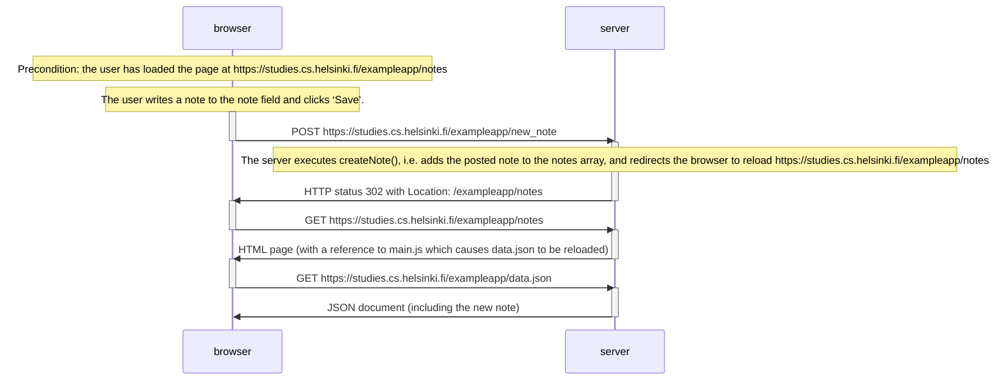

```mermaid
sequenceDiagram
	participant browser
	participant server

	Note over browser: Precondition: the user has loaded the page at https://studies.cs.helsinki.fi/exampleapp/notes
	Note over browser: The user writes a note to the note field and clicks ‘Save’.

	activate browser
	browser ->> server: POST https://studies.cs.helsinki.fi/exampleapp/new_note
	deactivate browser

	activate server
	Note over server: The server executes createNote(), i.e. adds the posted note to the notes array, and redirects the browser to reload https://studies.cs.helsinki.fi/exampleapp/notes
	server ->> browser: HTTP status 302 with Location: /exampleapp/notes
	deactivate server

	activate browser
	browser ->> server: GET https://studies.cs.helsinki.fi/exampleapp/notes
	deactivate browser
	
	activate server
	server ->> browser: HTML page (with a reference to main.js which causes data.json to be reloaded)
	deactivate server

	activate browser
	browser ->> server: GET https://studies.cs.helsinki.fi/exampleapp/data.json
	deactivate browser

	activate server
	server ->> browser: JSON document (including the new note)
	deactivate server
```
