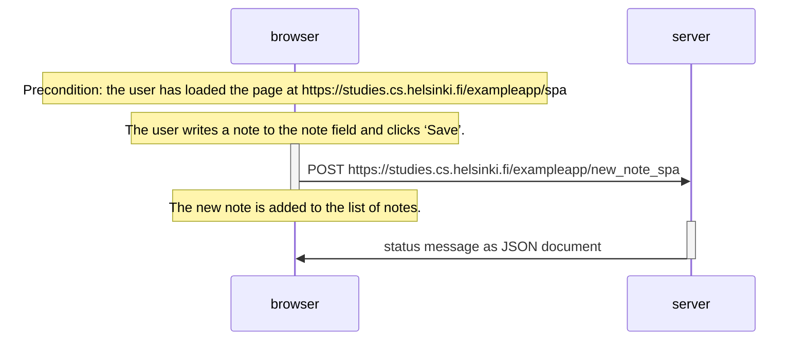

```mermaid
sequenceDiagram
	participant browser
	participant server

	Note over browser: Precondition: the user has loaded the page at https://studies.cs.helsinki.fi/exampleapp/spa
	Note over browser: The user writes a note to the note field and clicks ‘Save’.

	activate browser
	browser ->> server: POST https://studies.cs.helsinki.fi/exampleapp/new_note_spa
	Note over browser: The new note is added to the list of notes.
	deactivate browser

	activate server
	server ->> browser: status message as JSON document
	deactivate server
```
